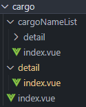
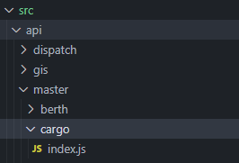
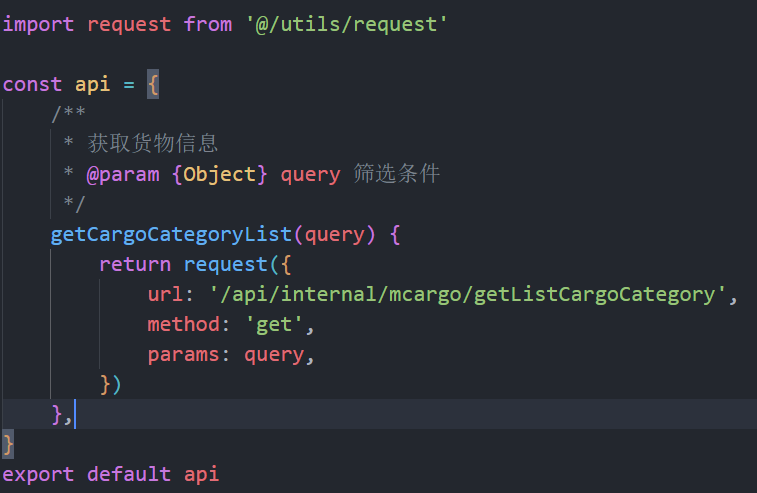

## 新建文件以及开发规范

### 新建 vue 文件

-   新建 vue 文件统一使用文件夹 + `index.vue` 的格式；例：
    
-   文件夹名称采用有语义化的驼峰式，禁止使用拼音首字母，例：`cargoName`。

-   vue 文件`template`部分，需要是一个`div`

-   `script`使用`setup`语法糖，记得加上自己业务的 `name`，例如 `<script setup name="Cargo">`

-   定义函数统一使用回调函数形式，例如`const save = () => {}`

### 新建 api 文件

-   新建 `api` 文件统一使用文件夹 + `index.js` 的格式；
    
-   统一定义在 `api` 中，`export default api`
    
